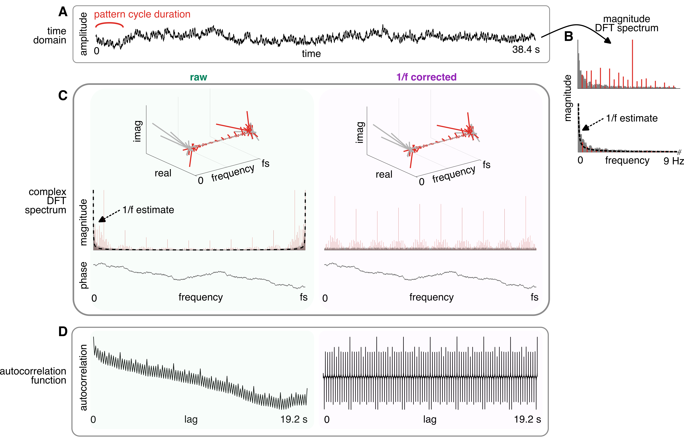

## acf_tools

**acf_tools** is a collection of MATLAB functions that can be used to work with autocorrelation in the context of rhythmic signal analysis. 

The library provides functions to compute autocorrelation function from a time-domain signal, while minimizing the bias from a 1/f noise that might be mixed in with the signal of interest. 

Additional tools allow using the resulting autocorrelation function to quantify periodic recurrence of a signal at particular rate. This can be used, for example, to estimate how prominent a particular periodic beat is represented within a signal. 



## installation 

Clone the project directory from github and add the directory (with all subdirectories) on MATLAB path. 

_**Dependencies**_: You also need to have the [rnb_tools package](https://github.com/TomasLenc/rnb_tools) on your MATLAB path. 


## basic usage

```matlab

% compute ACF after accounting for 1/f noise  
[acf, lags, ap_linear] = get_acf(x, ...
								 sampling_rate, ...
                                 'rm_ap', true, ...
                                 'f0_to_ignore', 0.5, ...
                                 'min_freq', 0.1, ...
                                 'max_freq', 9);

% do a basic plot 
f = figure();
ax = axes(f);
plot_acf(ax, acf, lags, 'prec', 1e6); 

% compute features from the autocorrelation function 
features_acf = get_acf_features(acf, ...
								lags, ...
                                lags_beat_related, ...
								lags_beat_unrelated);


```


