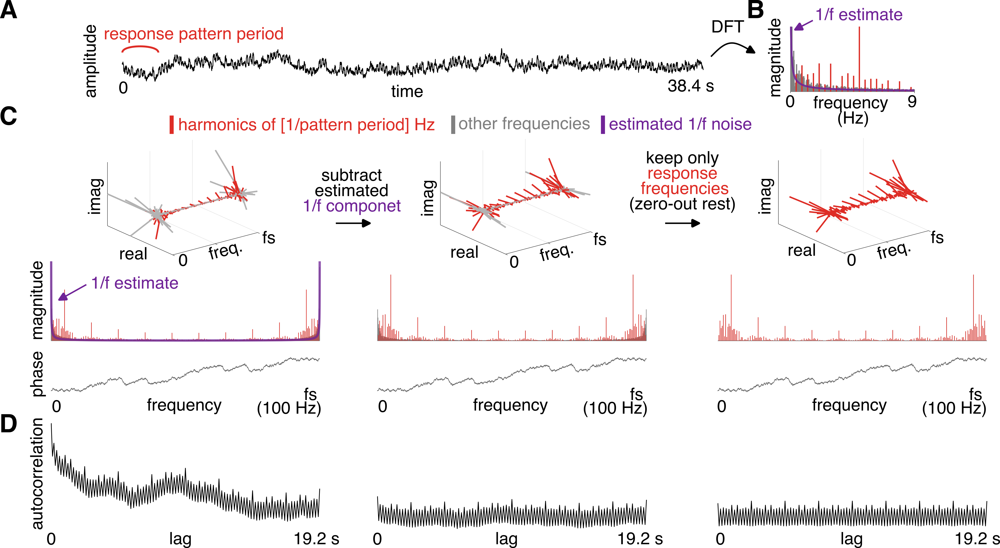

## acf_tools

**acf_tools** is a collection of MATLAB functions that can be used to work with autocorrelation in the context of measuring self-similarity in empirical signals to understand musical beat perception. 

The library provides functions to compute autocorrelation function from a time-domain signal, while minimizing the bias from a 1/f noise that might be mixed in with the signal of interest. 

Additional tools allow using the resulting autocorrelation function to quantify periodic recurrence of a signal at particular rate. This can be used, for example, to estimate how prominent a particular periodic beat is represented within a signal. 


**Figure 1**. Signal processing pipeline. 

**(A)** Continuous time-series comprising a sum of signal (repeating 2.4-s-long rhythmic pattern) and 1/f-like noise. 

**(B)** Magnitude spectrum of the signal calculated using Discrete Fourier Transform (only shown up to 9 Hz for visualization purposes). Frequencies corresponding to the pattern repetition rate and harmonics are highlighted in red. These frequencies fully capture the periodic signal, while noise is broadly distributed across all frequencies. The estimated 1/f-like noise component is indicated by a purple line. 

**(C)** Full complex-valued spectrum of the raw signal up to the sampling rate (fs = 100 Hz). The real and imaginary component as a function of frequency is shown on the top. Below, the same information is expressed as magnitude and phase as a function of frequency. Because the signal is real, the complex-valued spectrum is conjugate-symmetric around the Nyquist frequency (i.e., half of the sampling rate). The magnitude of the estimated noise component is shown in purple. (Middle) The complex-valued spectrum after the magnitude of the estimated noise has been subtracted, separately for each frequency. This subtraction does not affect the phase. (Right) The complex-valued spectrum after all frequency bins except of those capturing the response were set to zero. Again, this operation does not affect the phase spectrum. 

**(D)** Autocorrelation function calculated from the complex spectrum shown above. Notice how the 1/f noise distorts the signal on the left. Subtracting the 1/f estimate (middle) and zeroing-out signal-unrelated frequencies (right) minimizes this noise artifact. 


## installation 

Clone the project directory from github and add the directory (with all subdirectories) on MATLAB path. 

_**Dependencies**_: You also need to have the [rnb_tools package](https://github.com/TomasLenc/rnb_tools) on your MATLAB path. 


## quickstart


```matlab

% add the necessary library folders to MATLAB path (make 
% sure you change these to your local paths)
addpath(genpath('/datadisk/projects_git_dl/rnb_tools'));
addpath(genpath('/datadisk/projects_git_dl/acf_tools'));

clear all
close all

% define sampling rate
sampling_rate = 200; 

% define the shortest, unitary inter-onset interval for the rhythm
grid_ioi = 0.200; 

% define structure of the rhythmic pattern (1 = event, 0 = nothing)
pat = [1 1 1 0 1 1 1 0 1 1 0 0]; 

% create impulse-response kernel 
ir = get_square_kernel(sampling_rate, ...
        'duration', 0.100, ...
        'rampon', 0, ...
        'rampoff', 0 ...
        ); 

% simulate a "signal": repeating rhythmic pattern 
[x_clean, t] = get_s(pat, grid_ioi, sampling_rate, ...
                      'n_cycles', 16, 'ir', ir); 

% simulate 1/f noise
noise_exponent = -1.5; 
noise = get_colored_noise2([1, length(x_clean)], sampling_rate, noise_exponent); 

% scale the noise to the requested SNR 
snr = 1; 
x = add_signal_noise(x_clean, noise, snr);

%% ==============================================================

% compute ACF from the raw signal, WITHOUT accounting for 1/f noise  
[acf_raw, lags, ~, mX_raw, freqs] = get_acf(x, sampling_rate);

% fit 1/f noise using IRASA and subtract it from the spectrum before
% calculating the ACF 
% compute ACF after accounting for 1/f noise  
[acf_norm1, lags, aperiodic_estimate, ~, ~, ~, X_norm1] = get_acf(x, ...
                                 sampling_rate, ...
                                 'rm_ap', true, ...
                                 'ap_fit_method', 'irasa', ...
                                 'plot_diagnostic', true);
                             
% get the 1/f subtracted magnitude specxtrum                              
mX_norm1 = abs(X_norm1(1:length(freqs))); 

% After fitting and removing the 1/f noise, we can aplly step 2 of the
% noise correction procedure. This will only keep frequencies
% corresponding to the pattern repetition frequency and harmonics where the
% response is expected to occur. All other frequencies will be zeroed out. 

% we will need to provide the fundamental frequency of the response (in our
% case it's the pattern repetition rate)
pattern_duration = length(pat) * grid_ioi; 
response_f0 = 1 / pattern_duration; 

% compute ACF after accounting for 1/f noise  
[acf_norm2, ~, ~, ~, ~, ~, X_norm2] = get_acf(x, ...
                     sampling_rate, ...
                     'rm_ap', true, ...
                     'ap_fit_method', 'irasa', ...
                     'response_f0', response_f0, ...
                     'only_use_f0_harmonics', true, ...
                     'plot_diagnostic', true);

% get the 1/f subtracted and noise-zeroed magnitude specxtrum                              
mX_norm2 = abs(X_norm2(1:length(freqs))); 

%% ==============================================================

% Let's measure the prominence of periodicity at 0.8 s. In order to
% normalize the meaure, we will contrast to periodicities at 0.6, 1.0, and
% 1.4 s.

% we will use all valid lags, i.e. up to half signal duration 
max_lag = length(x) / sampling_rate / 2; 

% Make sure there's no overlap with muiltiples of meter-unrelated lags, and 
% also the pattern repetition period. 
lags_beat_related = get_lag_harmonics(...
                            0.8, ...
                            max_lag,...
                            'lag_harm_to_exclude', [0.6, 1.0, 1.4] ...
                            ); 

% Make sure there's no overlap with muiltiples of meter-related lags, ...
lags_beat_unrelated = get_lag_harmonics(...
                            [0.6, 1.0, 1.4], ...
                            max_lag,...
                            'lag_harm_to_exclude', [0.8] ...
                            ); 

% compute features from the autocorrelation function 
features_acf_raw = get_acf_features(acf_raw, ...
                                lags, ...
                                lags_beat_related, ...
                                lags_beat_unrelated);

features_acf_norm1 = get_acf_features(acf_norm1, ...
                                lags, ...
                                lags_beat_related, ...
                                lags_beat_unrelated);

features_acf_norm2 = get_acf_features(acf_norm2, ...
                                lags, ...
                                lags_beat_related, ...
                                lags_beat_unrelated);

fprintf('\nraw ACF: \nmean z-score at beat-related lags = %.2f\n', ...
        features_acf_raw.z_meter_rel);
fprintf('\n1/f-subtracted ACF: \nmean z-score at beat-related lags = %.2f\n', ...
        features_acf_norm1.z_meter_rel);
fprintf('\nnoise zeroed-out ACF: \nmean z-score at beat-related lags = %.2f\n', ...
        features_acf_norm2.z_meter_rel);


%% ==============================================================
% summary figure 

f = figure('color', 'white');

fontsize = 9; 

ax = subplot(4, 3, 1:3);
plot(ax, t, x); 
ax.XLabel.String = 'time (s)'; 
ax.YLabel.String = 'amplitude'; 
ax.FontSize = fontsize; 
box(ax, 'off'); 

% plot raw ACF
ax = subplot(4, 3, 4:5); 
plot_acf(ax, acf_raw, lags, 'prec', 1e6, 'linew', 0.7, ...
         'lags_meter_rel', lags_beat_related, ...
         'lags_meter_unrel', lags_beat_unrelated, ...
          'opacity_lagz', 0.4); 
ax.XLabel.String = 'lag (s)'; 
ax.YLabel.String = 'autocorrelation'; 
ax.FontSize = fontsize; 
box(ax, 'off'); 

% plot raw FFT
ax = subplot(4, 3, 6); 
max_freq_to_plot = 10; 
signal_frequencies = [response_f0 : response_f0 : max_freq_to_plot]; 
plot_fft(freqs, mX_raw, ...
         'ax', ax, ....
         'maxfreqlim', max_freq_to_plot, ...
         'frex_meter_rel', signal_frequencies, ...
         'fontsize', fontsize); 
ax.YTick = []; 
ax.XAxis.Visible = 'on'; 
ax.XLabel.String = 'frequency (Hz)'; 
ax.YLabel.String = 'magnitude'; 

% plot 1/f component
hold(ax, 'on');
plot(ax, freqs, aperiodic_estimate, '--', 'color', 'k', 'linew', 2);    

% plot 1/f-subtracted ACF
ax = subplot(4, 3, 7:8); 
plot_acf(ax, acf_norm1, lags, 'prec', 1e8, 'linew', 0.7, ...
         'lags_meter_rel', lags_beat_related, ...
         'lags_meter_unrel', lags_beat_unrelated, ...
          'opacity_lagz', 0.4); 
ax.XLabel.String = 'lag (s)'; 
ax.YLabel.String = 'autocorrelation'; 
ax.FontSize = fontsize; 
box(ax, 'off'); 

% plot 1/f-subtracted FFT
ax = subplot(4, 3, 9); 
plot_fft(freqs, mX_norm1, 'ax', ax, 'maxfreqlim', 10, 'fontsize', fontsize, ...
         'frex_meter_rel', signal_frequencies); 
ax.YTick = []; 
ax.XAxis.Visible = 'on'; 
ax.XLabel.String = 'frequency (Hz)'; 
ax.YLabel.String = 'magnitude'; 


% plot 1/f-subtracted and noise-zeroed ACF
ax = subplot(4, 3, 10:11); 
plot_acf(ax, acf_norm2, lags, 'prec', 1e8, 'linew', 0.7, ...
         'lags_meter_rel', lags_beat_related, ...
         'lags_meter_unrel', lags_beat_unrelated, ...
          'opacity_lagz', 0.4); 
ax.XLabel.String = 'lag (s)'; 
ax.YLabel.String = 'autocorrelation'; 
ax.FontSize = fontsize; 
box(ax, 'off'); 

% plot 1/f-subtracted and noise-zeroed FFT
ax = subplot(4, 3, 12); 
plot_fft(freqs, mX_norm2, 'ax', ax, 'maxfreqlim', 10, 'fontsize', fontsize, ...
         'frex_meter_rel', signal_frequencies); 
ax.YTick = []; 
ax.XAxis.Visible = 'on'; 
ax.XLabel.String = 'frequency (Hz)'; 
ax.YLabel.String = 'magnitude'; 


```


