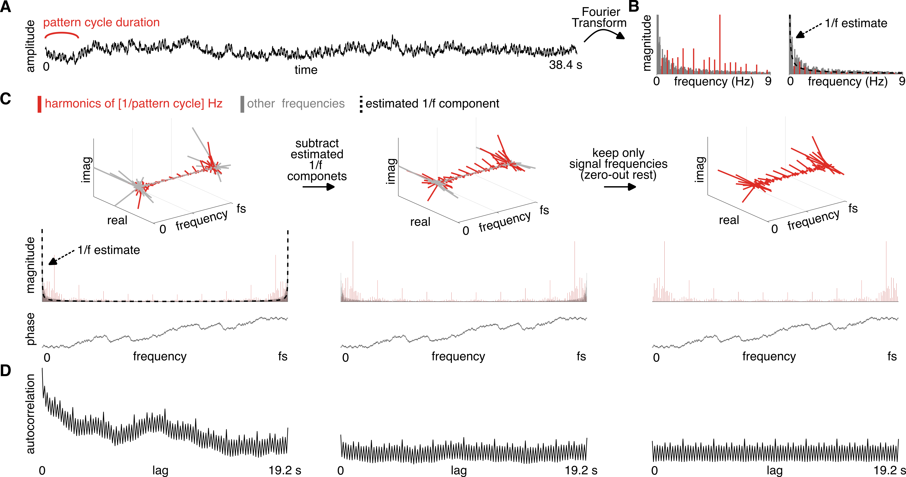

## acf_tools

**acf_tools** is a collection of MATLAB functions that can be used to work with autocorrelation in the context of rhythmic signal analysis. 

The library provides functions to compute autocorrelation function from a time-domain signal, while minimizing the bias from a 1/f noise that might be mixed in with the signal of interest. 

Additional tools allow using the resulting autocorrelation function to quantify periodic recurrence of a signal at particular rate. This can be used, for example, to estimate how prominent a particular periodic beat is represented within a signal. 


**Figure 1**. Signal processing pipeline. **(A)** Continuous time-series comprising a sum of signal (repeating 2.4-s-long pattern) and 1/f-like noise. **(B)** Magnitude spectrum of the signal calculated using Fourier Transform is shown on the left (only shown up to 9 Hz for visualization purposes). Frequencies corresponding to the pattern repetition rate and harmonics are highlighted in red. These frequencies fully capture the periodic signal, while noise is broadly distributed across all frequencies. The spectrum on the right is obtained by replacing all signal frequencies by the mean magnitude at neighboring bins. This spectrum is used to compute the 1/f estimate using a procedure similar to the [fooof package](https://fooof-tools.github.io/fooof/). **(C)** The top row shows the real and imaginary component of complex Fourier spectrum as a function of frequency. Red vectors correspond to the "signal" frequencies, i.e. pattern repetition rate and harmonics. Bottom row shows the same information but transformed into magnitude and phase as a function of frequency. Note that the spectrum goes up to the sampling rate and it is conjugate-symmetrical around they nyquist frequency. (Left) Original spectrum of the signal. Black dotted line represents the estimated 1/f component. (Middle) Spectrum after subtracting the estimated 1/f component. Notice that while the magnitude changes, phase remains constant. (Right) 1/f-subtracted spectrum after setting all frequencies except of "signal-related" frequencies to zero. Again, phase remains the same while magnitudes change. **(D)** Autocorrelation function calculated from the complex spectrum shown above. Notice how the 1/f noise distorts the signal on the left. Subtracting the 1/f estimate (middle) and zeroing-out signal-unrelated frequencies (right) minimizes this noise artifact. 


## installation 

Clone the project directory from github and add the directory (with all subdirectories) on MATLAB path. 

_**Dependencies**_: You also need to have the [rnb_tools package](https://github.com/TomasLenc/rnb_tools) on your MATLAB path. 


## quickstart


```matlab

clear all
close all

% add the necessary library folders to MATLAB path (make 
% sure you change these to your local paths)
addpath(genpath('/datadisk/projects_git_dl/rnb_tools'));
addpath(genpath('/datadisk/projects_git_dl/acf_tools'));

% define sampling rate
sampling_rate = 200; 

% define the shortest, unitary inter-onset interval for the rhythm
grid_ioi = 0.200; 

% define structure of the rhythmic pattern (1 = event, 0 = nothing)
pat = [1 1 1 0 1 1 1 0 1 1 0 0]; 

% create impulse-response kernel 
ir = get_square_kernel(sampling_rate, ...
        'duration', 0.100, ...
        'rampon', 0, ...
        'rampoff', 0 ...
        ); 

% simulate a "signal": repeating rhythmic pattern 
[x_clean, t] = get_s(pat, grid_ioi, sampling_rate, ...
                      'n_cycles', 16, 'ir', ir); 

% simulate 1/f noise
noise_exponent = -1.5; 
noise = get_colored_noise2([1, length(x_clean)], sampling_rate, noise_exponent); 

% scale the noise to the requested SNR 
snr = 1; 
x = add_signal_noise(x_clean, noise, snr);

% ==============================================================

% when fitting the 1/f noise, we will ignore peaks at frequencies 
% corresponding to the pattern repetition frequency and 
% harmonics. 
pat_f0_to_ignore = 1 / (length(pat) * grid_ioi); 

% compute ACF after accounting for 1/f noise  
[acf_norm, lags, aperiodic_estimate, mX_raw, freqs] = get_acf(x, ...
                                 sampling_rate, ...
                                 'rm_ap', true, ...
                                 'f0_to_ignore', pat_f0_to_ignore, ...
                                 'ap_fit_flims', [0.1, 9], ...
                                 'plot_diagnostic', true);
                             
% define the closest and furthest neighbouring bin (on each side) that is going
% to be used to subtract the 1/f noise from magnitude spectrum
noise_bins = [3, 13];
% normalize FFT magnitude spectrum by subtracting mean magnitude at 
% neighouring bins 
mX_norm = subtract_noise_bins(mX_raw, noise_bins(1),  noise_bins(2)); 
                             
% compute ACF WITHOUT accounting for 1/f noise  
[acf_raw, lags] = get_acf(x, sampling_rate, 'rm_ap', false);


% ==============================================================

% Let's measure the prominence of periodicity at 0.8 s. In order to normalize
% the meaure, we will contrast to periodicities at 0.6 and 1.0 s. 

% we will use all valid lags, i.e. up to half signal duration 
max_lag = length(x) / sampling_rate / 2; 

% Make sure there's no overlap with muiltiples of meter-unrelated lags, and 
% also the pattern repetition period. 
lags_beat_related = get_lag_harmonics(...
                            0.8, ...
                            max_lag,...
                            'lag_harm_to_exclude', [0.6, 1.0, 1.4] ...
                            ); 

% Make sure there's no overlap with muiltiples of meter-related lags, ...
lags_beat_unrelated = get_lag_harmonics(...
                            [0.6, 1.0, 1.4], ...
                            max_lag,...
                            'lag_harm_to_exclude', [0.8] ...
                            ); 

% compute features from the autocorrelation function 
features_acf = get_acf_features(acf_norm, ...
                                lags, ...
                                lags_beat_related, ...
                                lags_beat_unrelated);

fprintf('\nThe mean z-score at beat-related lags = %.2f\n\n', features_acf.z_meter_rel);


% ==============================================================
% summary figure 

f = figure('color', 'white');

fontsize = 9; 

ax = subplot(3, 3, 1:3);
plot(ax, t, x); 
ax.XLabel.String = 'time (s)'; 
ax.YLabel.String = 'amplitude'; 
ax.FontSize = fontsize; 
box(ax, 'off'); 

% plot raw ACF
ax = subplot(3, 3, 4:5); 
plot_acf(ax, acf_raw, lags, 'prec', 1e6, 'linew', 0.7, ...
         'lags_meter_rel', lags_beat_related, ...
         'lags_meter_unrel', lags_beat_unrelated, ...
          'opacity_lagz', 0.4); 
ax.XLabel.String = 'lag (s)'; 
ax.YLabel.String = 'autocorrelation'; 
ax.FontSize = fontsize; 
box(ax, 'off'); 

% plot raw FFT
ax = subplot(3, 3, 6); 
max_freq_to_plot = 10; 
signal_frequencies = [pat_f0_to_ignore : pat_f0_to_ignore : max_freq_to_plot]; 
plot_fft(freqs, mX_raw, ...
         'ax', ax, ....
         'maxfreqlim', max_freq_to_plot, ...
         'frex_meter_rel', signal_frequencies, ...
         'fontsize', fontsize); 
ax.YTick = []; 
ax.XAxis.Visible = 'on'; 
ax.XLabel.String = 'frequency (Hz)'; 
ax.YLabel.String = 'magnitude'; 

% plot 1/f component
hold(ax, 'on');
plot(ax, freqs, aperiodic_estimate, '--', 'color', 'k', 'linew', 2);    

% plot noise-subtracted ACF
ax = subplot(3, 3, 7:8); 
plot_acf(ax, acf_norm, lags, 'prec', 1e8, 'linew', 0.7, ...
         'lags_meter_rel', lags_beat_related, ...
         'lags_meter_unrel', lags_beat_unrelated, ...
          'opacity_lagz', 0.4); 
ax.XLabel.String = 'lag (s)'; 
ax.YLabel.String = 'autocorrelation'; 
ax.FontSize = fontsize; 
box(ax, 'off'); 

% plot noise-subtracted FFT
ax = subplot(3, 3, 9); 
plot_fft(freqs, mX_norm, 'ax', ax, 'maxfreqlim', 10, 'fontsize', fontsize, ...
         'frex_meter_rel', signal_frequencies); 
ax.YTick = []; 
ax.XAxis.Visible = 'on'; 
ax.XLabel.String = 'frequency (Hz)'; 
ax.YLabel.String = 'magnitude'; 
```


